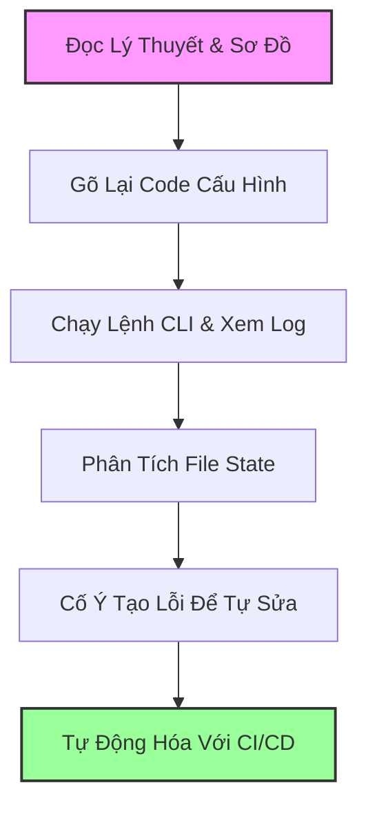

# 🗺️ Lộ Trình Học Terraform Bài Bản & Thực Chiến Cho CloudOps

> **Mục tiêu:** Giúp bạn làm chủ Terraform từ căn bản đến nâng cao dưới góc nhìn của một Kỹ sư CloudOps, đồng thời chuẩn bị tốt nhất cho **bài kiểm tra Terraform vào Thứ 4** này.

---

> [!IMPORTANT]
> **Chiến lược học tập trước Thứ 4:**
> Vì bạn có bài kiểm tra vào thứ 4, hãy ưu tiên đọc và thực hành theo **Giai đoạn 0 (Ôn thi cấp tốc)** trước. Giai đoạn này tập trung vào các câu hỏi lý thuyết kinh điển, các kịch bản lỗi thực tế (troubleshooting) và các lệnh CLI cốt lõi thường xuất hiện trong các bài kiểm tra. Sau đó, hãy học tuần tự các giai đoạn tiếp theo để phục vụ cho công việc CloudOps lâu dài.

---

## 📅 Bản Đồ Lộ Trình Học Tập (Roadmap Hub)

Dưới đây là các giai đoạn được phân chia chi tiết dưới dạng các file riêng biệt. Hãy click vào từng liên kết để đi vào nội dung chi tiết:

| Giai đoạn | Tên File & Liên Kết | Nội Dung Trọng Tâm | Trạng Thái |
| :--- | :--- | :--- | :--- |
| **Giai đoạn 0** | [🔴 Lộ Trình Cấp Tốc Cho Bài Kiểm Tra Thứ 4](file:///Users/nguyenphutai/.gemini/antigravity-ide/brain/5694fa37-2def-45f1-9afd-e16ab5042128/terraform_cap_toc_thu_4.md) | Các câu hỏi trọng tâm, giải thích các khái niệm dễ nhầm lẫn (count vs for_each, local vs remote-exec, state commands), cheat-sheet CLI và kịch bản thi thực hành. | `[ ] Chưa học` |
| **Giai đoạn 1** | [📘 Core Fundamentals & HCL Syntax](file:///Users/nguyenphutai/.gemini/antigravity-ide/brain/5694fa37-2def-45f1-9afd-e16ab5042128/terraform_phase1_basics.md) | Tư duy Declarative, cấu trúc HCL, cách dùng Provider, Resource vs Data Source, vòng đời tài nguyên (Lifecycle block) và các lệnh CLI cơ bản. | `[ ] Chưa học` |
| **Giai đoạn 2** | [💾 State Management & Backend Architecture](file:///Users/nguyenphutai/.gemini/antigravity-ide/brain/5694fa37-2def-45f1-9afd-e16ab5042128/terraform_phase2_state_management.md) | Bản chất của `terraform.tfstate`, cơ chế Remote Backend, State Locking, các lệnh quản trị state nâng cao (`state mv`, `state rm`, `import`). | `[ ] Chưa học` |
| **Giai đoạn 3** | [⚙️ Dynamic Configurations & Modules](file:///Users/nguyenphutai/.gemini/antigravity-ide/brain/5694fa37-2def-45f1-9afd-e16ab5042128/terraform_phase3_dynamic_modules.md) | Tham số hóa code (Variables, Outputs, Local), meta-arguments (`count`, `for_each`, `depends_on`), Khối động (`dynamic block`) và thiết kế Module chuẩn hóa. | `[ ] Chưa học` |
| **Giai đoạn 4** | [🚀 Production Best Practices & CI/CD](file:///Users/nguyenphutai/.gemini/antigravity-ide/brain/5694fa37-2def-45f1-9afd-e16ab5042128/terraform_phase4_production_ci_cd.md) | Quản lý môi trường với Workspaces, Provisioners (và tại sao nên tránh), xử lý dữ liệu nhạy cảm (Sensitive), Policy as Code (Sentinel, OPA) và tích hợp CI/CD (GitHub Actions / GitLab CI). | `[ ] Chưa học` |

---

## 🛠️ Phương Pháp Học Đạt Hiệu Quả Cao Nhất

1. **Tuyệt đối không sao chép (copy-paste) code:** Hãy tự gõ các file cấu hình `.tf` để làm quen với cú pháp HCL và tránh các lỗi cú pháp nhỏ (như thiếu ngoặc, gõ sai từ khóa).
2. **Quan sát sự thay đổi của State:** Sau mỗi lần chạy `terraform apply`, hãy mở file `terraform.tfstate` để xem cấu trúc JSON bên dưới. Hiểu cách Terraform lưu trữ dữ liệu là 80% sức mạnh của công cụ này.
3. **Thực hành Troubleshooting:** Đừng hoảng sợ khi gặp thông báo lỗi màu đỏ của Terraform. Nó thường chỉ ra rất rõ lỗi ở dòng nào và file nào. Hãy tập đọc log lỗi, đây là kỹ năng CloudOps quan trọng nhất.
