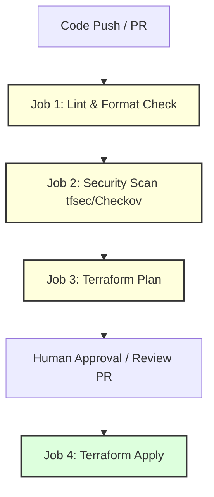

# 🚀 Giai Đoạn 4: Production Best Practices & CI/CD

> **Mục tiêu:** Hiểu sâu các mô hình phân tách môi trường, cơ chế bảo vệ thông tin nhạy cảm, chính sách kiểm soát hạ tầng (Policy as Code), và cách tự động hóa quy trình triển khai hạ tầng an toàn bằng pipelines CI/CD trong thực tế doanh nghiệp.

---

## 🏢 1. Phân Tách Môi Trường: Workspaces vs Folder-Based

Khi quản lý hạ tầng quy mô lớn, bạn bắt buộc phải tách biệt các môi trường `dev`, `staging`, và `production` để tránh lỗi một nơi làm hỏng toàn bộ hệ thống. Có hai cách tiếp cận chính:

### 1.1 Terraform Workspaces (Phân tách logic)
Terraform cho phép bạn tạo nhiều không gian làm việc (Workspaces) trên cùng một thư mục mã nguồn. Mỗi workspace sẽ sở hữu một file state riêng biệt.

*   *Lệnh CLI thao tác với Workspace:*
    ```bash
    terraform workspace new dev      # Tạo workspace mới tên là dev
    terraform workspace new prod     # Tạo workspace mới tên là prod
    terraform workspace list         # Liệt kê các workspace đang có
    terraform workspace select dev   # Chuyển sang workspace dev
    ```
*   *Sử dụng biến môi trường động trong code HCL:*
    ```hcl
    resource "aws_instance" "web" {
      ami           = "ami-0c55b159cbfafe1f0"
      # Đổi instance type dựa trên workspace đang chọn
      instance_type = terraform.workspace == "prod" ? "t3.medium" : "t2.micro"

      tags = {
        Name = "web-server-${terraform.workspace}"
      }
    }
    ```

### 1.2 Phân tách bằng thư mục (Folder-Based Separation) - Khuyến nghị thực tế
> ⚠️ **Best Practice:** Trong môi trường sản xuất thực tế, các chuyên gia CloudOps khuyên dùng phương pháp phân tách bằng thư mục hoặc dùng công cụ như **Terragrunt**, thay vì dùng Terraform Workspaces cho các môi trường quan trọng (như Production).
*   *Lý do:* Workspaces dùng chung code nên nếu ai đó sửa đổi cấu hình sai lầm và chạy nhầm workspace `prod`, hậu quả sẽ cực kỳ nghiêm trọng. Phân tách bằng thư mục giúp cô lập hoàn toàn quyền truy cập (Access Control) trên Git và Cloud của từng môi trường.

Cấu trúc phân tách thư mục chuẩn:
```
environments/
├── dev/
│   ├── main.tf
│   ├── variables.tf
│   └── backend.tf (Trỏ tới S3 bucket dev)
└── prod/
    ├── main.tf
    ├── variables.tf
    └── backend.tf (Trỏ tới S3 bucket prod với quyền truy cập cực kỳ hạn chế)
```

---

## 🔒 2. Quản Lý Secrets (Sensitive Data Management)

Khi viết Terraform, việc vô tình để lộ mật khẩu, Access Keys hay Token là nguyên nhân số một dẫn đến mất an toàn thông tin.

### 2.1 Truyền dữ liệu nhạy cảm thông qua Biến Môi Trường (Environment Variables)
Thay vì khai báo mật khẩu trực tiếp trong file code hoặc file `terraform.tfvars`, hãy dùng biến môi trường với tiền tố `TF_VAR_`:

1.  Khai báo biến trong code HCL:
    ```hcl
    variable "database_password" {
      type      = string
      sensitive = true # Đảm bảo giá trị biến không bị in ra log
    }
    ```
2.  Thiết lập giá trị trong Terminal của bạn (hoặc cấu hình trong CI/CD Variables):
    ```bash
    export TF_VAR_database_password="SuperSecretPassword123!"
    ```
3.  Khi chạy `terraform apply`, Terraform sẽ tự động đọc giá trị từ biến môi trường `TF_VAR_database_password`.

### 2.2 Tích hợp giải pháp Quản lý Secrets (HashiCorp Vault / AWS Secrets Manager)
Giải pháp tốt nhất là đọc Secrets trực tiếp từ các kho lưu trữ bảo mật bằng Data Source tại thời điểm chạy:

```hcl
# Truy vấn mật khẩu DB được lưu sẵn trong AWS Secrets Manager
data "aws_secretsmanager_secret_version" "db_password" {
  secret_id = "production-db-credentials"
}

resource "aws_db_instance" "default" {
  allocated_storage   = 20
  engine              = "postgres"
  username            = "admin"
  # Gán mật khẩu động từ Secrets Manager vào resource
  password            = data.aws_secretsmanager_secret_version.db_password.secret_string
}
```

---

## 🚨 3. Quy Trình Tự Động Hóa CI/CD Cho Terraform (GitOps)

Trong CloudOps, ta không chạy `terraform apply` trực tiếp từ máy cá nhân. Mọi thay đổi phải thông qua Pull Request trên Git và được triển khai tự động bởi các CI/CD Runners.

### 3.1 Mô hình Pipeline chuẩn (GitHub Actions):



### 3.2 File cấu hình GitHub Actions Mẫu (`.github/workflows/terraform.yml`)
```yaml
name: "Terraform CI/CD Pipeline"

on:
  push:
    branches:
      - main
  pull_request:
    branches:
      - main

jobs:
  terraform:
    name: "Terraform Action"
    runs-on: ubuntu-latest
    env:
      AWS_ACCESS_KEY_ID: ${{ secrets.AWS_ACCESS_KEY_ID }}
      AWS_SECRET_ACCESS_KEY: ${{ secrets.AWS_SECRET_ACCESS_KEY }}

    steps:
      - name: Checkout Code
        uses: actions/checkout@v3

      - name: Setup Terraform
        uses: hashicorp/setup-terraform@v2
        with:
          terraform_version: 1.5.0

      - name: Terraform Format Check
        run: terraform fmt -check

      - name: Terraform Init
        run: terraform init

      - name: Terraform Validate
        run: terraform validate

      - name: Terraform Plan
        id: plan
        run: terraform plan -no-color -out=tfplan
        continue-on-error: false

      - name: Terraform Apply
        if: github.ref == 'refs/heads/main' && github.event_name == 'push'
        run: terraform apply -auto-approve tfplan
```

---

## 🛡️ 4. Kiểm Soát Tuân Thủ (Policy as Code)

Để ngăn chặn các kỹ sư vô tình tạo ra tài nguyên quá đắt đỏ hoặc không an toàn (ví dụ: tạo máy ảo mở cổng 22 cho toàn internet), doanh nghiệp áp dụng **Policy as Code**.

*   **Sentinel (HashiCorp):** Công cụ kiểm soát chính sách độc quyền cho Terraform Enterprise/Cloud.
*   **Open Policy Agent (OPA) / Checkov / TFSec:** Các công cụ mã nguồn mở kiểm tra bảo mật tĩnh (Static Security Analysis) cho file `.tf` trước khi triển khai.

*Ví dụ chạy checkov quét bảo mật:*
```bash
pip install checkov
checkov -d . # Quét toàn bộ thư mục hiện tại để phát hiện các lỗ hổng bảo mật
```

---

## ✍️ Bài Tập Thực Hành Giai Đoạn 4

1.  **Bài tập 1 (CI/CD GitHub Actions):** Hãy fork một repository trống trên GitHub, đưa code Terraform Docker của bạn lên đó. Hãy cấu hình một GitHub Action Pipeline tự động chạy `terraform fmt -check`, `terraform init`, và `terraform validate` mỗi khi bạn tạo một Pull Request.
2.  **Bài tập 2 (Sensitive Output):** Tạo một file `outputs.tf` trả về mật khẩu database được cấu hình là `sensitive = true`. Hãy chạy `terraform apply` và quan sát cách Terraform che giấu giá trị này ở terminal. Thử chạy lệnh `terraform output` và giải thích làm sao để xem được giá trị thực tế của biến này khi cần thiết.
